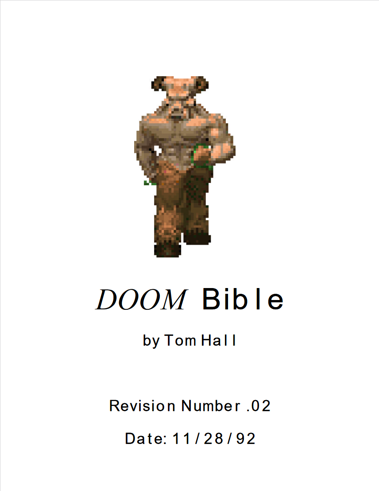

# Capítulo 1: Design Inicial
"É perigoso ir sozinho! Leve isto." - Velho em uma caverna, _The Legend of Zelda_ (1986)

## Introdução

A especificação de qualquer *software* é uma das etapas mais importantes no seu desenvolvimento.   
Jogos eletrônicos se encaixam também na categoria de _software_. Mas as mesmas regras se aplicam a eles?  

Apesar de serem _software_, existem alguns detalhes sobre o desenvolvimento de jogos que os diferem de outros projetos de _software_. No entanto, a etapa da especificação não deixa de ser de grande importância para eles.

Pode ser sua intenção começar a trabalhar na história, na arte, música ou programação do seu jogo imediatamente. E as chances são altas de que você já tem uma boa ideia do que fazer com pelo menos um desses. Mas enquanto eles são todos aspectos nos quais você e sua equipe vão trabalhar eventualmente, é importante dar forma a estas idealizações. Ou seja, colocar essas ideias "no papel" de alguma forma.

Qual é a importância real disso? Primeiramente, a organização. A diferença entre um projeto organizado que alcança sucesso e um que acaba cancelado pode estar na etapa de formalização das ideias. Isso ocorre por vários motivos:

- Diferenças de visões criativas entre integrantes da equipe;
- Esquecimento de decisões e escolhas feitas anteriormente;
- Aumento constante do escopo do projeto;
- Falta de foco na manutenção do projeto;
- entre outros...

Estes problemas devem ser evitados para que o risco de cancelmaneto seja o menor possível. Por isso, a primeira coisa que fazemos é sempre documentar tudo o que planejamos realizar no projeto, para ter-se uma base sólida para consultar quando necessário. Você não precisa delimitar o seu projeto inteiramente no primeiro momento, e naturalmente acontecerão mudanças no decorrer do desenvolvimento. Mas é importante criar um documento que servirá para ancorar o seu projeto, pelo menos na fase inicial.

Além de ser um ótimo jeito de organizar e documentar suas ideias, manter um documento assim pode ser útil caso entre um novo membro na sua equipe (e ele precise entender o projeto para trabalhar nele), ou se precisar demonstrar suas ideias para um possível investidor, ou em uma campanha de _crowdfunding_. Dessa forma, o documento deve conter a quantidade de detalhes que será relevante ao leitor. Em vários casos também é interessante que inclua detalhes sobre o que será necessário na construção do jogo.

Entramos então no mérito do **design**. Você pode pensar no design como um planejamento, uma idealização, ou como uma especificação. Geralmente, no contexto de desenvolvimento de jogos, nós chamamos o documento de design pelo nome criativo "Game Design Document" (Documento de Design de Jogo).

## Game Design Document (GDD)

Não existe um padrão exato para como o GDD deve ser criado. E se você procurar online, você vai encontrar dúzias de padrões e modelos/templates diferentes. Na hora de delimitar o formato do seu documento, é importante considerar quem o verá e quanto tempo você quer passar detalhando-o. Pessoalmente, eu tento ser curto e objetivo nos meus, tentando passar o máximo de informação no menor espaço possível.

O seu GDD pode estar em qualquer lugar entre um documento simples de 3 ou 4 páginas, até um enorme documento descrevendo cada detalhe do funcionamento de seu jogo como a [_Doom Bible_](https://5years.doomworld.com/doombible/doombible.pdf) (GDD do jogo Doom de 1993). Como o seu projeto acabou de começar, meu conselho é seguir a primeira opção. Porém, durante o desenvolvimento do seu projeto, é esperado que o documento cresça consideravalmente, então sinta-se à vontade para colocar quanto detalhe achar interessante no futuro.

Eu criei um template bem simples que costumo usar para a proposta inicial do jogo, e vou usá-lo aqui para exemplificar um preenchimento inicial. Se desejar usá-lo: 
- [Versão Word](/Arquivos/modelo_GDDv1.2.docx) 
- [Versão LibreOffice](/Arquivos/modelo_GDDv1.2.odt)

Se procura por inspiração, vários exemplos notáveis de GDDs podem ser encontrados no seguinte repositório no Github: [Awesome GDDs](https://github.com/Roobyx/awesome-game-design). Note que a maioria destes vão ser muito maiores e mais complexos do que a especificação do seu projeto. Isso é esperado, pois são projetos muito maiores que o escopo comum para um jogo _indie_. Outra coisa interessante é que, se você observar, vários desses documentos são bem diferentes do que o jogo final se tornou. Isso também pode acontecer com o seu projeto, e pode ser algo bom ou ruim.

Enquanto eu deixei várias notas no modelo do documento, achei relevante falar brevemente sobre cada campo aqui. Você pode encontrar o GDD inicial para os 2 projetos desenvolvidos em conjunto com o manual nos seguintes links: 
- [Sleepy Runner](https://github.com/D-Waack/sleepy-runner-godot4/blob/main/Docs/Sleepy_GDDv1.0.pdf)
- [Topdown Space Shooter](https://github.com/D-Waack/vortex-tautology-demo/blob/main/Docs/VortexTautology_GDDv1.0.pdf)

### Conceito
A primeiro seção, "Conceito", tem o objetivo de explicar a ideia por trás do jogo de maneira simples e sucinta.  
O "título provisório" é exatamente o que o nome implica. Talvez te interesse incluir um título de projeto. Não se preocupe muito em decidi-lo, o título final do jogo em si pode ser decidido mais a frente no projeto.  
O "conceito inicial" é uma explicação de qual é a ideia geral para o jogo. Explique o que é seu jogo, e porque o conceito é interessante.  
"Gêneros" se refere a classificação do jogo: É um shooter como _Call of Duty_? Ou um jogo de plataforma como _Super Mario Odyssey_? Talvez seja um jogo de corrida, ou um _metroidvania_. Qual é o estilo da arte? O estilo da câmera? Pense em outros gêneros também. Gêneros geralmente serão usados no _marketing_ de seu jogo.  
A intenção de "detalhes interessantes" é dar um destaque aos atributos únicos ou de maior interesse no seu jogo. Isso pode ser parte do que descreveu no conceito inicial.  
O "público alvo" é autoexplicativo. Para qual público este jogo é criado? Ou seja, que tipo de jogador você deseja interessar com seu projeto?

### Detalhes Técnicos
A segunda seção, "Detalhes Técnicos" se refere a vários aspectos que serão importantes durante a construção do jogo. Caso não saiba como responder um, não se preocupe, isso ficará melhor definido conforme seu projeto evoluir.  
A "plataforma" é, como o nome sugere, a plataforma onde seu jogo será executado. Podem ser computadores, celulares, navegadores, consoles de jogos, entre outros. E qualquer combinação destes. Lembre-se que fazer uma versão para um ambiente diferente (port) pode não ser um processo tão simples. Certas ferramentas e motores vão facilitar muito esse processo, para outros casos será impossível, e você terá que refazer seu projeto em outro ambiente. O mesmo pode acontecer entre diferentes sistemas operacionais de computador. A plataforma em que deseja que seu jogo rode deve influenciar a escolha do ambiente de desenvolvimento.  
As "tecnologias" estão intimamente relacionadas ao tópico anterior. Nós entraremos no mérito de como preencher esse tópico no capítulo seguinte. Porém, basicamente, se referem a o que você vai usar para criar o seu jogo. Por exemplo, _engines_ (motores) como Unity, Unreal e Godot, ou _frameworks_ como Spritekit, Phaser e Starling. Talvez algo mais específico como RPG Maker, ou algo mais fácil de usar como o Game Maker. Qual linguagem será usada? Talvez javascript ou C++? Ou quem sabe usará uma ferramenta em que não há necessidade de programar em uma linguagem? Novamente, será mais interessante preencher isto no próximo capítulo, a não ser que já tenha alguma preferência. 
A "interação" se refere às interfaces com as quais o seu jogador vai interagir com o jogo em si. Seja através de _touchscreen_, controles, mouses/teclados ou algum outro tipo de dispositivo de _input_. Também vale incluir situações especiais como controle por movimento/giroscópio. No caso de controles de console, é interessante incluir se existe vibração e outras reações do controle também.  
A "monetização" se refere a como você pretende ganhar dinheiro com o jogo. Se pretende vendê-lo como um jogo separado. Ou se será free 2 play com microstransações para diferentes personagens, cosméticos, etc. Quem sabe seu jogo é completamente grátis e não pretende ganhar dinheiro algum com ele? Qualquer que seja sua ideia, aqui é o lugar onde pode incluí-la. 
As "ferramentas de desenvolvimento" são uma lista de ferramentas que serão utilizadas para a criação de recursos diversos como música, arte, modelos 3D, mapas, entre vários outros.

### Detalhes Conceituais
A terceira seção, "Detalhes Conceituais", começa a lidar com alguns aspectos mais abstratos, relacionados à narrativa. É possível que seu jogo não tenha um enredo, personagens ou um cenário específico. Por exemplo, um jogo como _Candy Crush_ ou algo como Xadrez dificilmente vai ter uma história. Neste caso, você pode pular ou deletar os tópicos que julgar irrelevantes. 
O "cenário" se refere ao mundo onde o jogo acontece. Deve ser descrito o tipo de ambiente onde a história aconteceria. Pode ser simplesmente descrito como um mundo _steampunk_ ou _cyberpunk_, ou um mundo fantástico, ou um mundo igual ao mundo real. Você também pode dar mais detalhes. O importante é que um leitor potencial (e você mesmo) consiga imaginar o mundo onde a história do jogo acontece.  
Os "personagens" são os diversos personagens que aparecerão no seu jogo. Protagonistas, NPCs, inimigos, vilões todos podem ser considerados personagens. Caso tenha algum rascunho da aparência de cada um, seria interessante incluí-los aqui também. Mas isso pode ser feito mais adiante, caso ainda não tenha nenhum.  
O "enredo" se refere a história do jogo em si, a narrativa que será contada durante o decorrer do jogo. Não é necessário entrar em detalhes minuciosos sobre cada acontecimento no primeiro momento, mas, se preferir, pode ser feito. Lembre-se que durante o desenvolvimento você e seu time podem fazer várias decisões de mudança na história, então talvez poupe o seu tempo descrever de maneira bem simples até que o projeto esteja mais avançado. Criar uma _storyboard_ demonstrando a história eventualmente também deve estar nos seus planos, mas isso também pode esperar até que tenha um design definido para os personagens.  
O "contexto" engloba qualquer detalhe do enredo que não encaixe nos tópicos anteriores. Por exemplo, se isso é uma sequência, e o que ocorreu antes. Ou se existem acontecimentos paralelos que afetam a história do jogo, mas não são mostrados durante a narrativa.  
Os "temas" são palavras-chave que definirão o estilo do enredo que tem em mente.
O "formato da narrativa" se refere a como a história será contada. Serão _cutscenes_ cinematográficas, ou algo mais simples como caixas de diálogo, animações simples, etc.?

### Detalhes de Gameplay
A quarta seção, "Detalhes de Gameplay" se refere mais especificamente a como o jogo vai funcionar. Enquanto é bom decidir alguns destes detalhes inicialmente, é esperado que essas decisões mudem no decorrer do desenvolvimento do seu projeto, e que evoluam com o passar do tempo. Aqui, o conceito de mecânica é muito importante. Uma mecânica é uma regra ou conjunto de regras que define como o jogo vai funcionar e como o jogador vai interagir com ele.  
As "mecânicas primárias" são as mecânicas que definem o seu jogo e o seu estilo. Por exemplo, para o jogo Super Mario Bros. seriam pular e correr. Para o jogo _Call of Duty_, isso seria correr, mirar e atirar. Elas se referem especificamente ao _core loop_, ou seja, as ações principais que o seu jogador fará durante o seu tempo jogando. Podem ser poucas como em Super Mario, ou muitas como em jogos de sobrevivência.
As "mecânicas secundárias" são qualquer mecânica ou regra que não seja principal ao _core loop_ do jogo. Por exemplo, o funcionamento de menus, como funciona a loja de itens em um jogo, como os pontos serão contados, etc...  
O tópico "world/level design" se refere a como as fases, mapas ou mundo em um jogo serão construídos para que o jogo funcione da maneira esperada. Por exemplo, eu poderia colocar o sonic e sua física em uma fase do jogo super mario. Porém, os mapas do Super Mario não são próprios para o tipo de jogo que é o Sonic, onde o objetivo é atingir grandes velocidades e encontrar o melhor caminho. Da mesma forma, Mario não teria como navegar a maioria das fases do Sonic. E nenhum teria muito o que fazer no mapa de GTA V.  
Os "objetivos/condições de vitória" são o que o jogador deve conseguir para atingir vitória no jogo. Seja navegar ao final de uma fase, coletar itens, resolver um enigma, derrotar um inimigo, ou uma combinação de todos esses. Sinta-se livre para descrever como o seu jogo decorre, e como uma condição de vitória pode levar a outra.  
Analogamente, as "condições de derrota" se referem a o que leva a derrota do jogador. Isso pode ser em termos de vidas, tempo, energia, entre vários outros. Em certos casos, pode haver mais de uma condição de derrota, e em muitos jogos, existem vários graus diferentes de derrota. Em _castlevania_ para o _NES_, cair em um buraco sem fundo ou levar dano de um inimigo leva a uma derrota temporária, ou uma derrota de grau menor, a morte do personagem. Entretanto, caso o jogador morra várias vezes sem coletar vidas novas, ele alcança o estado "game over", ou seja, a derrota final, que faz com que tenha que jogar o jogo todo novamente a partir da primeira fase.  
O "desafio" é tudo aquilo que se coloca entre o jogador e sua condição de vitória. Crie um desafio muito baixo e seu jogo pode ficar sem graça, crie um desafio muito alto e seu jogo pode ficar injusto. Na maioria dos jogos, é preferível que exista uma curva de dificuldade, onde o jogo começa fácil e fica mais desafiador a medida que o jogador começa a dominar melhor suas mecânicas.  
O "sistema de recompensa" envolve o que o seu jogador ganhará ao completar determinado desafio. Isso pode vir em forma de powerups, itens colecionáveis, ugprades ao personagem, equipamento/armas alternativas, skins diferentes, novas habilidades, o nome do jogador em um _ranking_, entre vários outros. Isso é um tópico importante se deseja manter seu jogador engajado continuamente.

### Detalhes Audiovisuais
A quinta seção, "Detalhes Áudiovisuais", diz respeito aos estilos planejados para aspectos visuais e auditórios.  
Não há muito o que explicar para estes casos. "Estilo visual" é sobre como o jogo será visualmente (pixel art, voxel, vector, 3D realista, 3D fantástico, etc.). 
"Estilo musical" diz respeito ao tipo de música que tocará no fundo do seu jogo (música orquestral, _chiptune_, rock progressivo, música de elevador, vários tipos diferentes, etc.). 
"Efeitos sonoros" se refere ao estilo do _sound design_ no geral, se tenta ser realista ou fantástico, se atmosférico ou satisfatório, ou qualquer outra categoria que tiver em mente. 
O "estilo da interface" tem a ver com os menus e telas que o jogador verá durante o jogo (se existem informações em tela como HUDs, contadores de itens/vidas/pontos, entre outros elementos. 

### Objetos e Assets de Jogo
A sexta seção, "Objetos e Assets de Jogo" será preenchida principalmente no decorrer do projeto conforme suas ideias forem evoluindo. Aqui você vai listar artefatos que serão criados e usados no decorrer do jogo, como entidades e objetos de cenário, e cada uma de suas respectivas representações visuais/sonoras.  
O tópico "entidades" se refere a qualquer personagem que aparecerá no jogo. Este tópico é análogo aos "personagens" na seção de detalhes conceituais, mas está mais focado em simplesmente listar os personagens/vilões para referência.  
O tópico "objetos" deve conter qualquer objeto que não encaixe na categoria de "entidade". Isso geralmente vai incluir objetos interativos que não são simplesmente parte do cenário (eles podem ser "parte" do cenário, mas que geralmente seriam objetos criados separadamente para que possa haver interação com eles).  
O tópico "texturas/modelos/sons/etc." se refere a todo tipo de recurso audiovisual que será necessário durante o jogo, como _sprites_ ou modelos de personagens (e suas texturas), planos de fundo, _skyboxes_ (planos de fundo para o céu), mapas/fases do jogo (sejam imagens ou modelos), músicas de fundo, efeitos sonoros, e quaisquer outros artefatos necessários.

### Planos
A última seção, "Planos", possui apenas um tópico, "wishlist", que é um lugar que eu reservo para listar ideias que eu tive para o jogo durante o desenvolvimento, e que não decidi se implementarei ou não ainda. É apenas uma seção para anotações, e não precisa ser preenchida se não for relevante.

## Conclusão
Ao final desse capítulo, você deveria ter uma ideia de como começar a criar seu GDD, ou idealmente já o tenha preenchido conforme lia o capítulo.

No [próximo capítulo](https://github.com/D-Waack/manualindiedev/blob/main/Capitulos/capitulo2.md) vamos lidar com a etapa de "Preparação", onde vamos decidir alguns detalhes importantes como o ambiente de desenvolvimento (engine/framework/linguagem) e como organizaremos os arquivos do projeto.
