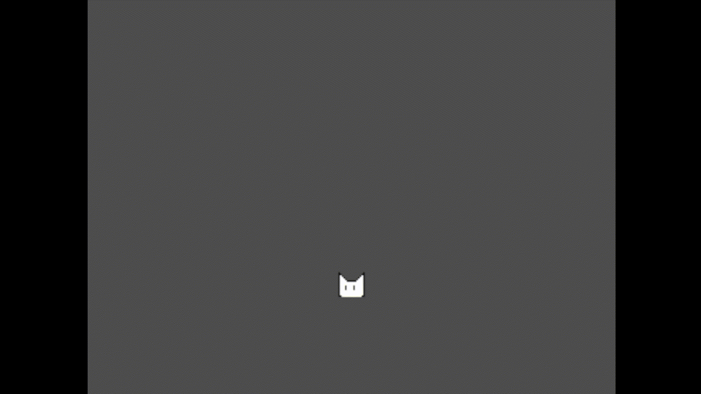

# Capítulo 4: O Primeiro Ciclo - Rumo ao Protótipo 0
"Ciência não é sobre 'por que'. É sobre 'por que não'." - Cave Johnson, _Portal 2_ (2011)

  

## Introdução

O [capítulo anterior](https://github.com/D-Waack/manualindiedev/blob/main/Capitulos/capitulo3.md) ofereceu uma abordagem bem teórica sobre como funcionaria o ciclo de desenvolvimento, mas você provavelmente ainda tem várias dúvidas. De certa forma, o desenvolvimento é como um jogo de tabuleiro. Você pode ler as regras, mas só aprenderá realmente quando colocá-las na prática.

E, nesse sentido, a prática será os primeiros ciclos de desenvolvimento. Existem várias formas de separar as etapas da produção dos jogos, mas aqui a dividiremos da seguinte forma: **Protótipo 0** -> **Alfa** -> **Beta** -> **Produto final**

Se você joga, os termos _alfa_ e _beta_ não devem ser desconhecidos a você. Eles se referem a estados diferentes do desenvolvimento de um _software_. No contexto de jogos, isso é um pouco vago. Alguns vão definir a diferença entre _alfa_ e _beta_ como "um está bem incompleto e o outro está quase completo". Outros ainda vão dizer que versões beta são aquelas apresentáveis para a audiência, e que podem ser publicadas para teste.

Eu ainda incluo mais uma etapa, o Protótipo 0. Para o contexto deste manual, vou definir estas etapas da seguinte maneira:

- Protótipo 0: Primeira versão do jogo para testar a ideia, quase nada além da ideia central do jogo é implementada
- Alfa: Faltam diversos sistemas e funções a serem implementadas
- Beta: Sistemas e funções principais já foram todos implementados, resta poli-los e consertar _bugs_

Seguiremos esta ordem durante o manual. Logo, o primeiro passo é o Protótipo 0.

## O Protótipo 0

A ideia por trás do Protótipo 0 é destilar o conceito de seu jogo a um ponto que você tenha **apenas** sua essência, e implementar isto.

O que isso quer dizer na prática?

Sprites, modelos, música, mapas são todos desnecessários. Nada disso pertence ao protótipo 0. Na verdade, seu primeiro protótipo deve parecer muito mais como um jogo de _Atari_ do que um jogo moderno. Se fosse _Super Mario_, você poderia ter um quadrado correndo e pulando. Se fosse _Zelda_, talvez você teria um quadrado andando na tela e espetando inimigos (também quadrados) com um similar retângulo.

Esses exemplos são exageros, você não precisa se apegar ao minimalismo de tal maneira. Se você tem um artista no time, não precisa deixá-lo ocioso até o fim da criação deste protótipo, e se você já tem algo feito, não precisa evitar seu uso de propósito (apesar de ser uma opção). Se desejar ter algo visual em tela, pode interessar usar recursos grátis tirados, por exemplo, do site [Open Game Art](https://opengameart.org/). A intenção é apenas que você crie o protótipo para sentir sua ideia com as próprias mãos.

Dessa forma, se você trabalha sozinho, não se preocupe em criar nenhum artefato audiovisual. E se você trabalha em equipe, não se preocupe em incluir nenhum artefato audiovisual no projeto, por enquanto. Durante essa etapa, o trabalho principal vai ser entre designer e programador.

A intenção do protótipo 0 não é criar uma representação do seu jogo, é criar a base inicial dele. Como uma casa, você constrói uma fundação antes de começar a construir os cômodos. Se a fundação não estiver firme, a casa vai desmoronar.

Dessa forma, o seu primeiro passo é definir as mecânicas principais do seu jogo e implementá-las de maneira simples.

## Protótipo 0 - Exemplo 1
Na maioria dos casos, começamos qualquer projeto criando uma pasta para ele. Na minha _engine_ de escolha, isso pode ser feito no próprio editor. Aqui, vou descrever os passos para minha _engine_ de escolha, Godot. Mas independente do ambiente que escolher, você terá de seguir passos similares.

Ao criar o projeto, somos apresentados ao menu principal da _engine_. Neste caso, já vemos o visualizador/editor de mapas imediatamente. Meu próximo passo sempre costuma ser criar as pastas de arquivos na estrutura que decidi anteriormente.

Em seguida, eu passo por algumas configurações que serão relevantes para a construção do jogo. No momento, estou preocupado apenas com o **nome do projeto** e o **tamanho da tela**. O tamanho dela é importante decidir cedo no desenvolvimento, pois isso vai afetar o seu jogo. Principalmente para questões de _câmera_ e quanto cabe em sua tela. Nesse caso, como trata-se de um jogo para celulares, optei por um tamanho padrão de 1080x720, mas talvez vá mudá-lo mais a frente. Essa resolução não é estática, e será mudada para se adequar à tela do celular do jogador, mas para isso, devo incluir também a opção de _stretch_.

Após fazer essas mudanças, pressiono CONTROL + S para salvar meu projeto, e passo a trabalhar no protótipo em si.

Na _engine_ Godot, todos os elementos de um jogo são divididos em _cenas_. Cenas são um conceito comum para várias _engines_, e geralmente essas cenas são o elemento executável primário de um jogo. Ou seja, uma cena seria equivalente a um mapa ou fase. Ao rodar o seu jogo, a _engine_ partirá de uma cena específica, e poderá mudar para outras cenas durante a execução.

Essas cenas executáveis são então compostas de vários elementos. Por exemplo, de um mapa com colisões, um personagem controlável, e vários obstáculos. Já é possível enxergar uma fase com estes elementos.

TODO -> montar diagrama exemplo

No Godot, toda cena é uma estrutura de árvore. Estruturas de árvore são compostas de um nó pai e vários nós filhos. Aqui, estes nós filhos representam diferentes objetos de cada cena. Por exemplo, um personagem que se move na tela seria um _CharacterBody_ ou _CharacterBody2D_. O mapa pode ser composto de vários objetos estáticos _StaticBody3D_/_StaticBody2D_, ou de um _Tilemap_ (mapa formado por blocos).

Aqui, para criar a primeira cena, eu escolho a opção "2D Scene", e em seguida eu dou um nome para esta cena. Para nomenclatura de cenas e nós, eu costumo usar o padrão CamelCase (palavras diferentes vêm em uma mesma linha, mas cada palavra nova tem sua primeira letra em caixa alta). Eu faço isso para separar objetos instanciados de nomes de variáveis quando escrevo meus scripts. Mas você pode nomear suas cenas como preferir.

Em seguida, eu adiciono os elementos que vou precisar para a criação desse primeiro mapa teste. Ou seja, adiciono nós filhos. No caso, um nó para o mapa em si (Tilemap), um nó para a câmera (Camera2D), e um nó que representará o personagem jogável (CharacterBody2D). Por experiência, eu já sei exatamente quais são os nós que precisarei para isso, mas é normal que você precise pesquisar nas primeiras vezes.

Ao final, temos uma cena TestMap com alguns nós filhos. Esses são os **blocos principais** para o meu protótipo 0. Um personagem jogável, um mapa com o qual ele poderá interagir, e uma câmera para acompanhar o personagem durante o jogo.

Por enquanto, se executar essa cena, vou notar que ela não faz nada. Não há nada para executar nela, apenas uma câmera apontada para um espaço vazio. O próximo passo é incluir objetos nessa cena. Em qual objeto você trabalharia fica a seu critério. Eu começarei pelo mapa, pois não conseguirei testar o meu jogador sem ter um mapa onde ele possa andar.

Para isso, criei um simples tileset com 2 tiles diferentes. Em jogos 2D, tilesets são imagens onde você cria diferentes "azulejos" que pode usar como blocos em suas fases. Esse tipo de construção era comumente usada em jogos até a quarta geração de consoles, por motivos de memória e armazenamento. Hoje em dia, ainda é usada em jogos por questões de simplicidade, ou para emular um estilo de jogo antigo.

(Diagrama mostrando Tiles em jogos)

Como mencionei antes, não é relevante me dar ao trabalho de criar um mapa bom para o protótipo 0. Criei um tileset com 2 cores sólidas, cada um de 16x16 pixels. Por questões de facilidade de divisão da tela e padronização de tamanhos, costumamos usar múltiplos de 16 para os tamanhos de _tiles_ (e.g. 16, 32, 64, 128, e, raramente, 8). Esse print é da ferramenta _Aseprite_, que uso para criar pixel art.

Em seguida, adicionei o tileset aos arquivos do meu projeto. Nesse caso, junto ao arquivo do mapa. No Godot, é possível fazer isso arrastando o arquivo para dentro do editor. Também é possível encontrar a pasta no seu explorador de arquivos e adiconá-lo manualmente.

Agora, posso começar a criar o mapa, no outro canto da janela, opções de edição do nó selecionado aparecem. No campo Tile Set, adiciono um novo tileset, e clico nele, para que o editor de tileset apareça no canto inferior da tela. Arrastando o arquivo de imagem de meu tileset para este editor, a _engine_ já separa os tiles da maneira correta. (Isso acontece porque o tamanho padrão da _engine_ é 16x16 pixels. Caso meu tile tivesse um tamanho maior, seria necessário mudar essa configuração).

Agora, eu posso clicar em uma tile qualquer e desenhar o meu mapa como quiser.

Eu sabia que isso aconteceria, mas o tamanho que escolhi para minha tela é grande demais para o tamanho dos _tiles_. Isso é algo que vou ter que corrigir depois. Por enquanto, anotarei isso no meu documento de backlog.

Se eu executar essa cena do jeito que está, vou encontrar o mapa que desenhei, mas nada acontece. O próximo é incluir algum tipo de interação. E o melhor jeito de seguir com isso é criar o jogador. 

Um detalhe interessante sobre a estrutura de árvores, é que nós filhos podem ter seus próprios nós filhos. Talvez você tenha reparado que o nó do meu personagem tem um triângulo de aviso. Isso é porque nós do tipo "corpo" precisam de um formato de colisão para funcionarem normalmente. Nesse caso, basta incluir um nó de colisão como filho. 

Geralmente, quando existe alguma configuração faltante, o próprio editar vai me avisar. Aqui, ele reclama que é preciso incluir um formato para o nó de colisão, então eu o faço. Nesse caso, selecionei um simples formato de retângulo, que é provavelmente o que vou usar para o personagem de qualquer forma.

Agora, tenho um "personagem" com colisão, mas ele não é visível durante a execução. Isso é porque ele não contém nenhum nó visual. Por isso, incluo um nó "Sprite 2D" como filho. Eu já tenho um sprite para o personagem, mas desenhei um provisório apenas por questões de ilustração. Da mesma forma, um quadrado sólido também serviria, mas tente fazer um quadrado de cor diferente do mapa para facilitar sua visualização.

Adicionado o arquivo ao editor, e incluído como textura do sprite, percebo um problema com o meu desenho. Ele aparece um tanto embaçado no editor. Isso é porque a _engine_ tenta "filtrar" as imagens adicionadas para melhorar sua visualização. E isso costuma ser algo bom, mas para resoluções muito baixas (como 16x16 pixels), isso não é desejável. Nesse caso, basta mudar a configuração de filtro, e o sprite aparece da forma desejada.

Se eu executar a cena agora, notamos que o personagem existe, mas ele não faz nada. Aqui, me incomodo novamente com a resolução e a diminuo novamente nas configurações do projeto. Agora, o tamanho da câmera é pequeno demais para mostrar o mapa que criei abaixo, porém mais importante é o fato de que o personagem permanece flutuando no ar.

Para mudar isso, será necessário criar um _script_. Normalmente, _engines_ vão conter dois tipos de "corpos". Corpos 'rígidos' e 'cinemáticos'. Corpos rígidos têm sua física pré-programada, e são rígidos também no sentido de que o jeito que funcionam não é tão fácil de mudar. Corpos cinemáticos funcionam ao contrário, eles só funcionam se forem programados manualmente, mas é muito mais fácil mudá-los para que fiquem da maneira desejada. O corpo cinemático é mais adequado ao tipo de jogo que estou construindo.

Como mencionei antes, para dar funcionalidade a esse corpo será necessário incluir um script. Por ora, esse _script_ cuidará apenas de física e controle. Mas antes de fazer isso, é interessante tomar outro passo: Salvar o jogador como uma cena diferente. Isso é outro caso interessante que pode ser feito no Godot. Eu posso salvar qualquer nó e seus filhos como uma cena separada, e reutilizar essa cena como nó filho em diversas cenas diferentes.

Eu simplesmente salvo o nó do jogador como uma cena diferente, na minha pasta de Entities/Player, chamando-o de Player. Agora é possível clicar no botão de edição para abrir a cena do jogador. Eu também renomeio o nó pai dessa cena para "Player". Tanto a nova cena quanto o nó filho na cena do mapa.

Teria sido melhor renomear o nó antes de salvá-lo como filho, mas seguir assim é uma opção também. De qualquer forma, agora é mais simples adicionar um script a cena Player. Aproveitando a oportunidade, também levei o sprite do jogador para a mesma pasta onde salvei a cena do Player.

Eu sempre salvo o script com o mesmo nome e na mesma pasta que a cena. Uma adição interessante ao Godot 4 é a desse script padrão para o nó do tipo CharacterBody2D (corpo cinemático). 

Esse script já inclui controle lateral, pulo e gravidade. Se eu fosse escrever um _script_ do zero para essa mesma função, ele seria bem similar a esse. Porém, se eu rodar a cena de teste nesse exato momento, notarei que o meu jogador apenas cai. Isso é porque a câmera não está configurada para seguir o jogador.

Existem vários jeitos de fazer isso. O mais simples é simplesmente colocar a câmera como um nó filho do jogador. Enquanto eu não pretendo usar isso na versão final do jogo (pois quero ter diferentes câmeras em diferentes fases), para motivos do protótipo, isso vai servir. Incluo agora também no backlog o item "Ajustar funcionamento da câmera".

Na minha cena de teste, arrasto a câmera para que se torne nó filho do Player.

Agora, ao tentar executar a cena, a câmera segue o personagem como esperado, mas me deparo com outro problema. Eu não incluí colisão para o mapa que criei abaixo, e a gravidade faz com que o personagem caia diretamente através do chão.

Para esse caso, eu ainda não lembrava como configurar colisões em Tilemaps para o Godot 4 (pois tenho mais experiência com a versão 3). Então tive que pesquisar sobre, e [este vídeo](https://www.youtube.com/watch?v=1Uk1yhGtnOo) me mostrou como fazê-lo. Segui os passos descritos, e incluí colisão para os dois tiles que eu usei no tileset.

Agora, o personagem cai até encontrar o chão. E é possível controlá-lo com as setas e a barra de espaço. O movimento não é muito bom, e o personagem não é animado, nem sequer vira para o lado onde está andando, porque nenhuma dessas funções foi programada. 

Contudo, já temos os primeiros passo para o protótipo 0. Uma cena de testes, um personagem jogável, e um plano de ação. Antes de prosseguirmos, vamos entender o código que já temos.

### Desmistificando o código
Para alguém que acabou de começar sua jornada de desenvolvimento, isso pode parecer mágica. Mas não há mágica alguma em códigos, são apenas conjuntos de instruções, e, como eu mencionei anteriormente, entendendo as instruções, você entenderá o funcionamento do código. Então, vamos observar o _script_ do jogador que temos até agora.

Esse é um _script_ bem simples. Ele contém apenas uma função, e são apenas 29 linhas de código, incluindo linhas em branco.

A primeira linha é padrão na maioria dos scripts no Godot. "Extends" indica herança, que é um conceito de programação orientada a objetos. Em termos simples, quando um objeto herda de outro, ele recebe todos os atributos do objeto o qual ele herda. Nesse caso, nosso nó Player herda de CharacterBody2D. Ou seja, ele herda todos os atributos e funções da classe CharacterBody2D, e pode fazer coisas como andar pela tela e colidir com outros objetos. Sempre que você quiser entender qual é o tipo de objeto no Godot, você pode procurar por essa linha.

As linhas 4-8 são declarações de constantes e variáveis. Velocidade e velocidade de pulo **não mudarão** durante a execução do jogo, então declaras como _constant_ é melhor. Quanto ao que significam, SPEED é a velocidade com que o jogador anda horizontalmente, e JUMP_VELOCITY é a força com que o jogador pula quando o botão de pulo é pressionado. Além disso, temos a variável gravity, que herda um valor nas configurações, para que haja sincronia entre ela e corpos rígidos. No meu caso, eu não pretendo usar corpos rígidos por enquanto, mas posso decidir usá-os adiante, então vou manter essa linha assim.

Você pode editar estes valores e perceber como eles afetam o personagem. Diminuindo a gravidade, por exmeplo, o personagem leva mais tempo para cair. E aumentando a velocidade, ele anda mais rápido através da tela.

O próximo bloco de código é uma função. Funções são blocos de código que podem ser executados quando chamados em outras partes do código. No Godot, além de poder criar suas próprias funções, encontramos algumas funções comuns para quase todos os tipos de objetos. Estas são:

- Funções de inicialização: funções como _\_ready()_ e _\_init()_ são ótimas para incluir configurações importantes na hora que o seu nó entra em ação. Ambas rodam uma única vez em condições específicas. Ready roda quando o objeto é criado em uma cena, e init quando é instanciado como um objeto.
- Funções de execução: funções como _\_physics_process()_ e _\_process()_ rodam todo frame (geralmente, 60 vezes por segundo), e são as funções de código primárias para seus objetos. A maioria das ações, checks e mudanças são feitas nestas funções. É importante lembrar que muitos objetos ativos ao mesmo tempo com muitas instruções nessas funções vão causar com que a execução do seu jogo fique lenta.
- Funções _trigger_: Estas funções ficam separadas da execução dos processos, mas rodam como resposta a algum acontecimento. Geralmente, elas estão atreladas a signals (sinais), e vão rodar quando as condições necessárias forem realizadas. Por exemplo, quando o personagem jogável colidir com um espinho, um sinal vai indicar que ele rode a função que diminui seus pontos de vida por 1.

Para objetos submetidos a física como corpos, fazemos seu código por padrão na função _physics_process_, pois ela é a mais adequada para as operações deles. Ela recebe a variável _delta_, que indica o tempo entre a renderização do frame anterior e o atual. Esse delta é usado para que o tempo de execução de certas ações seja o mesmo, independente do tempo de execução do computador. Nesse caso, o _delta_ vai permitir que o movimento do jogador não seja afetado por lentidão ou rapidez do computador.

A linha 13 verifica se o jogador está no chão (_is_on_floor_). Caso não esteja, gravidade é aplicada na linha 14. Essa gravidade é aplicada diretamente ao valor Y da posição do jogador. Isso demonstra outro aspecto do funcionamento da _engine_. Todos os objetos em tela tem uma **posição**, representada por um vetor com 2 valores, uma posição X e uma posição Y (para objetos 2D, os 3D também têm uma posição Z). Mover estes objetos é simplesmente uma questão de mudar o valor X,Y dessas posições. 

Para movimento de objetos físicos, Godot utiliza a função _move_and_slide_. Essa função usa uma variável velocity (velocidade) e a aplica na posição do corpo que a invocou. Dessa forma, para movimentar um personagem em Godot 4, basta calcular sua velocidade através da variável velocity e rodar a função _move_and_slide_, como é feito na linha 28.

Para o caso da gravidade, o movimento vai para baixo (Y positivo), logo, gravidade * delta é aplicado para o corpo a cada frame quando não estiver tocando o chão.

Na linha 17, temos uma verificação de _input_. Caso pressione a tecla "ui_accept" (que se refere, por padrão, às teclas Enter e Barra de Espaço), e o personagem esteja no chão (pois ele não pode pular no ar), a velocidade Y é igualada a JUMP_VELOCITY, que é um valor negativo, causando com que o personagem mova-se para cima (Y negativo).

Após o cálculo do movimento vertical, é calculado o movimento horizontal. A linha 22 declara uma variável que verifica se as teclas direcionais estão pressionadas. Caso a tecla esquerda esteja pressionada, _direction_ é -1. Caso seja a direita, _direction_ é 1. Caso nenhuma ou ambas estejam pressionadas, _direction_ é 0. Isso indica qual direção o personagem deve se mover (-1 para esquerda, +1 para direita).

Em seguida, na linha 23, é verificado se essa direção é diferente de 0. Caso seja, o valor X de _velocity_ é alterado para que o personagem se mova na direção correta. Caso contrário, a velocidade do personagem é diminuída até chegar a 0 através da linha 26.

Por fim, move_and_slide é executado para que essas mudanças calculadas sejam atualizadas. Esse processo inteiro ocorre a cada frame, ou seja, em torno de 60 vezes por segundo.

Quebrando o código assim, linha por linha, fica muito mais fácil entender como ele funciona, e seguir com mudanças necessárias.

### Próximos Passos

Eu tenho um código para um personagem jogável de um plataforma. Mas isso não é o jogo que eu tinha planejado. Eu devo adaptar o código para seguir da forma que eu desejo. Primeiramente, isso se trata de um endless runner, então a princípio, meu personagem deveria correr sozinho.

Meu primeiro passo foi virar o personagem para que encare a direção onde ele andará. Em seguida, mudei o código da seguinte maneira:

Com essa mudança, o personagem não mais reage ao _input_ de direção do teclado, mas sempre segue em frente na direção para onde está olhando. Também incluí paredes nos cantos do mapa para que o personagem não caia no abismo.

Okay, a situação evoluiu um pouco, mas temos outro problema, o personagem continua tentando avançar para dentro da parede. Geralmente, em jogos desse estilo, encontrar um obstáculo significa o fim dessa jogada, ou esse tipo de obstáculo não existe. Para o caso do meu jogo, minha intenção é ter fases menores e mais fechadas, então precisarei de outro tipo de solução. 

A solução que cheguei é que o personagem irá trocar de direção quando encostar em uma parede ou algum obstáculo similar. Para isso, fiz com que o personagem trocasse de direção toda vez que encontrar uma parede.

Quanto ao botão de pulo, decidi mantê-lo por enquanto. Talvez eu faça pulos automáticos mais a frente no projeto, mas, por enquanto, usar a barra de espaço é o suficiente. Fiz também algumas mudanças ao mapa para testar o movimento.

## Protótipo 0 - Exemplo 2

## Quando parar

## Conclusão

O trabalho de criar esse protótipo inicial não é trivial. E esse é um passo muito importante. Se o seu time é inexperiente, ele vai naturalmente encontrar problemas e dúvidas durante o processo. 

No [próximo capítulo](https://github.com/D-Waack/manualindiedev/blob/main/Capitulos/capitulo5.md) discuto o que fazer quando você fica sem saber o que fazer durante a execução de etapas de programação.
